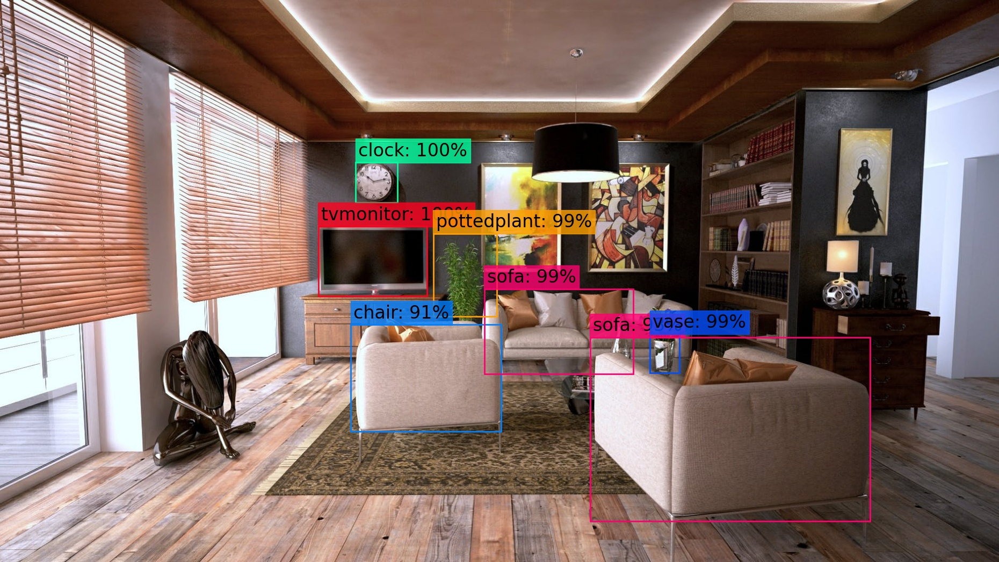
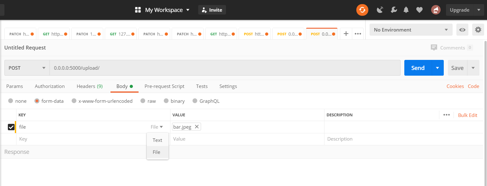
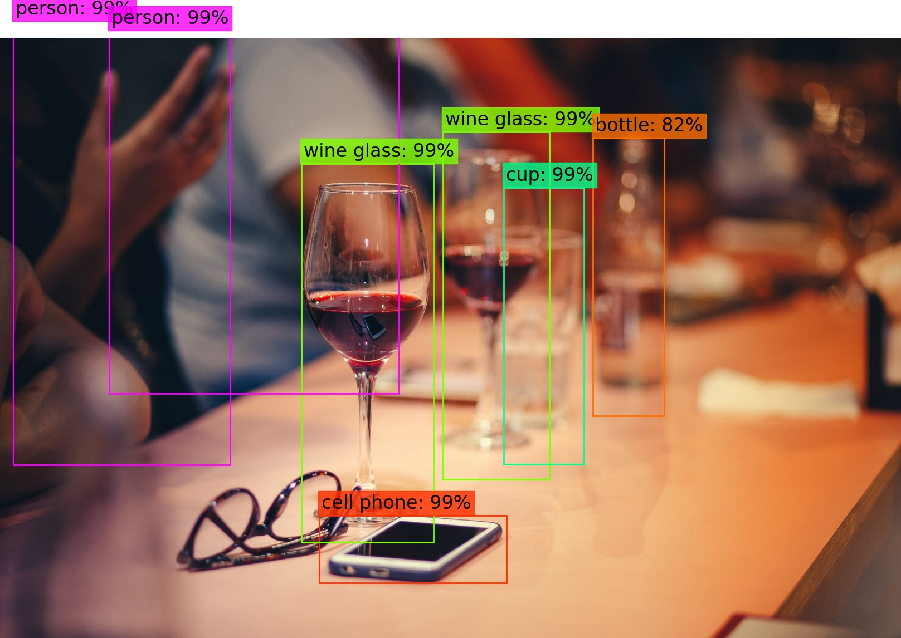
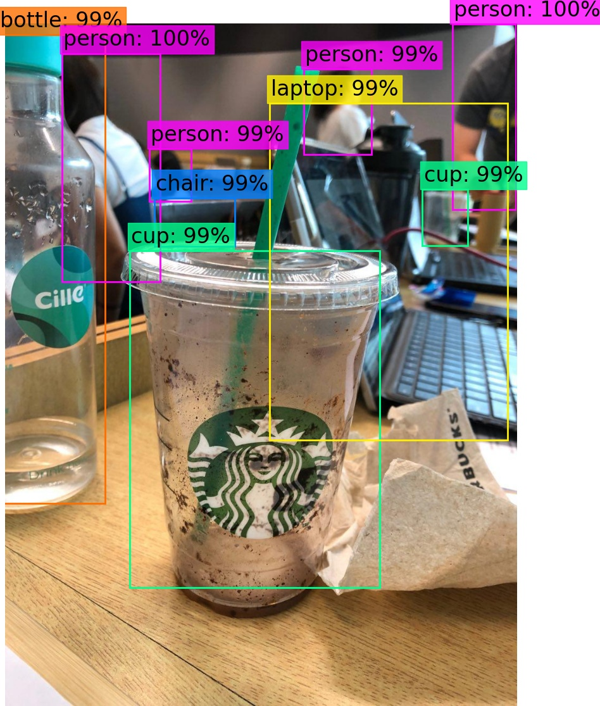
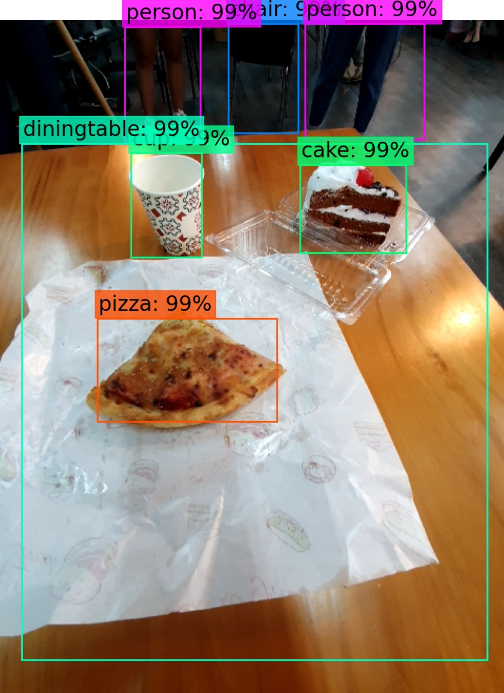

# A simple YOLOv3 Object Detection API in Python (Flask)


This repository provides a simple implementation of object detection in Python, served as an API using Flask. It is based on the YOLOv3 object detection system and we will be using the pre-trained weights on the COCO dataset. 


## Installation

### 1. Clone repository and install requirements

##### NOTE: I am using Windows OS and Pip for package installation, and I have to install pytorch separately else I will run into issues. The command for installation varies, so do check out the <a href="https://pytorch.org/">PyTorch website</a> and see which command you should run under "Quick Start Locally". For me, I run this:
```
pip install torch==1.5.0+cpu torchvision==0.6.0+cpu -f https://download.pytorch.org/whl/torch_stable.html
```
```
git clone git@github.com:yankai364/Object-Detection-Flask-API.git
cd Object-Detection-Flask-API
pip install -r requirements.txt
```


### 2. Download pre-trained weights
You can download the YOLOv3 pre-trained weights on the COCO dataset here:

https://pjreddie.com/media/files/yolov3.weights

Once downloaded, place the .weights file in the <b>weights</b> folder.


## API Documentation
There is only 1 endpoint in this API.

### Request

Method: <b>POST</b><br/>
Endpoint: <b>/upload/</b><br/>
Body: 
```
{ 
    "file": <image you want to detect objects in>
}
```

### Response
```
{ 
    "data": {
        "objects_count": {
            <detected object A>: <count>,
            <detected object B>: <count>
        },
        "objects_confidence": {
            <detected object A occurrence 1>: <confidence>,
            <detected object A occurrence 2>: <confidence>,
            <detected object B occurrence 1>: <confidence>,
            ...
        },
        "filename": <filename of plot output>
    }
}
```

## Usage

### 1. Start the application
```
cd Object-Detection-Flask-API
python app.py
```

If the application runs successfully, you should see the following:
```
 * Serving Flask app "app" (lazy loading)
 * Environment: production
   WARNING: This is a development server. Do not use it in a production deployment.
   Use a production WSGI server instead.
 * Debug mode: off
 * Running on http://0.0.0.0:5000/ (Press CTRL+C to quit)
```

### 2. Test the API
You can test the API using Postman. Let's test it with the image "bar.jpeg" in the images folder:


Open your Postman and configure the request [according to the documentation above](#api-documentation). Remember to set the "file" key to the "File" type and attach the image. Your request should look like this:



Click the Send button. The request may take a few seconds to complete, but you should receive the following response:

#### Response:
```
{
    "data": {
        "filename": "20200523_120754_313.jpg",
        "objects_confidence": [
            {
                "cell phone": 1.0
            },
            {
                "wine glass": 0.999997
            },
            {
                "wine glass": 0.999972
            },
            {
                "cup": 0.990166
            },
            {
                "person": 0.999974
            },
            {
                "bottle": 0.824177
            },
            {
                "person": 1.0
            }
        ],
        "objects_count": {
            "bottle": 1,
            "cell phone": 1,
            "cup": 1,
            "person": 2,
            "wine glass": 2
        }
    }
}
```


The application also draws the bounding boxes for each object in the image and saves it. The output image is named according to the filename in the response. You can find the below image in the <b>/instance/output</b> folder. 




And that's it! The pre-trained weights are decent in detecting everyday objects, so you can also test it using your own photos (instead of stock images):
<br/>



## Acknowledgements
<a href="https://pjreddie.com/darknet/yolo/">YOLOv3</a>